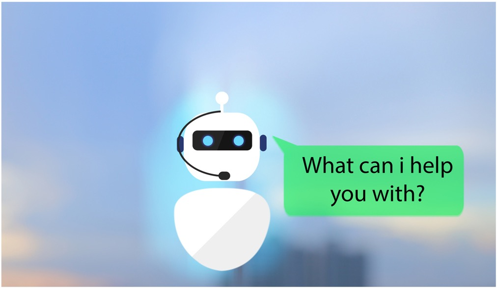

# ChatBot

## Design a semi-rule based chatbot using NLP

 Great Learning has a an <b>academic support department</b> which receives numerous support requests every day throughout the year. Based on a sample corpus(and using our linguistics skills), designed and developed an interactive ML/DL semi - rule based chatbot which can interact with the user, understand the problem and display the resolution procedure for generic request or redirect the request.
 

## ML libraries/Architectures 
NLTK, Scikit-learn (CountVectorizer), TensorFlow (Tokenizer), Keras, Neural Network 
